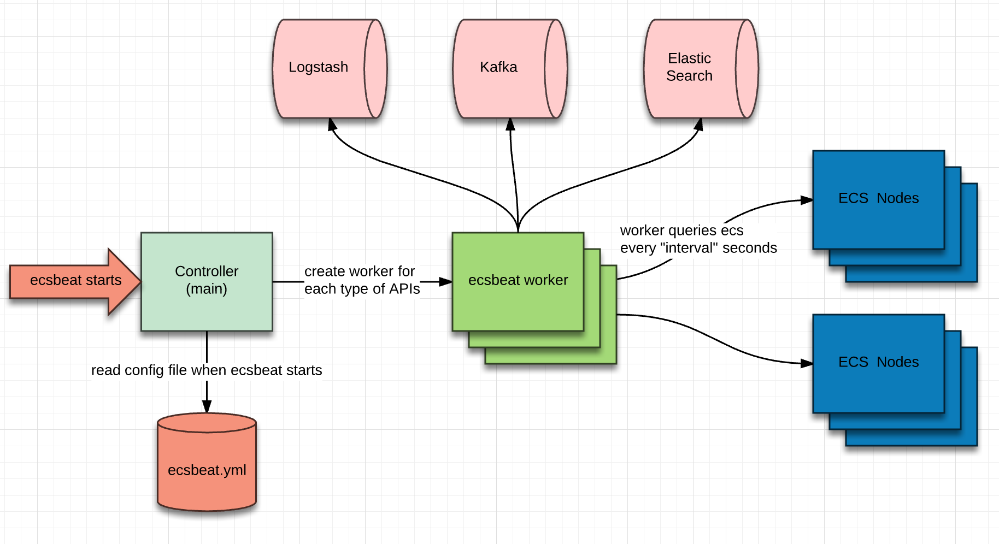

EcsBeat Design
==============

Ecsbeat is built on top of beat libraries and framework to query ECS via management APIs at prefine interval to collect ECS specific statistics, and finally send events to output server.

* ecsbeat loads configurations from ecsbeat.yml when it starts. This configration file includes below sections
	- default interval to query ECS
	- target ECS info, like credential to do the query, IPs, etc
	- supported APIs. interval could be overwritten for each API
	- common sections for beats like output
* creates bunch of workers and each of them takes a particular type ECS API
	- each worker is a goroutine. (The Go runtime multiplexes goroutines on fewer OS threads)
* each worker queries ECS at prefined interval. Which VDC(s) and which node(s) to query are determined by `level` of API in ecsbeat.yml. `level` could be 
	- system: pickup one node in the system and do the query
	- vdc: pickup one node in each vdc and do the query
	- node: query every node
	- dtinfo: query ECS for DT, it's handled specially
    (each query will be retried 3 times before it's given up)
* worker will process ECS response: generate event(s), translate them, add common fields and send them to output server.
	- ecsbeat doesn't care/know the data type in ecs response, it treats every field as generic type, so it gives us flexibility to add new APIs without code change or with a very few change

Resource Usage
==============
Ecsbeat is a very lightweigted service/process. Its docker image is only 20MB, and the memory usage is around 20MB as well when it's running. CPU usage is 0 at most of time because it doesn't do the fetch, usage could be up to 5% when it's doing fetch.

HA Consideration
================
Ecsbeat itself doesn't support HA natively just like other beats. By considering that only 1 instance can be running at any given time, the basic idea is to use some external method to monitor whether ecsbeat instance is running, and start this ecsbeat instance or another one on different host. Through this, the configuration file on diffrent hosts can be the same and without any change when one instance stops running and another one has to be waked up to take over.
